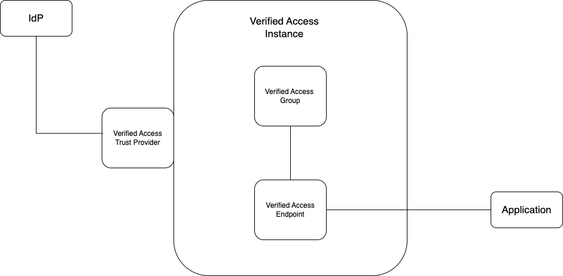

# Set up your AWS Verified Access Instance
## Pre-requirements
1. An AWS account
1. AWS cli with permissions to the AWS account
1. An application with a load balancer in front for which to grant verified access 
    1. the load balancer arn
    1. dns certificate
1. An Okta account already configured with two users and a group

## Introduction 

AWS Verified Access is an AWS managed service that enables enterprises to provide VPN-less secure network access to corporate applications, improve their security, and simplify their end-users’ experience. IT administrators can use AVA to build a unified set of fine-grained policies that define their users’ ability to access each of their applications. AVA verifies each access request in real-time and only connects users to the applications they are allowed to access. This eliminates broad access to corporate applications. For example, using AVA, administrators can define a policy to let only employees on the finance team, who are also using a device with malware protection enabled, access core financial applications. AVA utilizes a powerful policy language, Cedar, to enable enterprises to quickly create policy documents that secure access to their applications from any location and any network.

In this AWS Verified Access (AVA) tutorial, we will use the AWS CLI to set up an AWS Verified Access Instance (VAI) that is configured to take trust data–details from Okta regarding the security posture of the accessing user (see Pre-requirements). We will also set up a group for our endpoint, create that endpoint, and cosnfigure it with our application’s domain and load balancer (see Pre-requirements).


A VAI is the primary AVA object, bringing together trust data from trust providers on the one hand, and accessibility to the application being secured via AVA endpoint on the other. The group and endpoint policies of the instance arbitrates access, but we won’t address policy in this tutorial. The purpose of this tutorial is to set up the Verified Access Instance so that it is ready for policy. We do this by configuring the trust provider information with the endpoint information, so that the trust data can be evaluated against a policy (out of scope for this tutorial).

The completed tutorial achieves the following architecture:



In this diagram, we see the VAI connected to the IDP via the attached Verified Access Trust Provider VATP, the Verified Access Group as part of the VAI, and the Verified Access Endpoint (VAE) as a member of the Verified Access Group (VAG), which is also responsible for connecting the VAI to the application we are trying to secure. Esssentially, instead of accessing the application via authenticating through the IDP alone as in a typical VPN-less situation, users must get be granted authorization from the Verified Access Instance as well.

## Step 1: Create a Verified Access Instance

To create a Verified Access Instance, use the following snippet as a guide:

````
aws ec2 create-verified-access-instance \
--region us-west-2 \
--description "test 2022-11-04"
````

For `region`, add the region in which you want to create the instance. Any string can be used with `description`.

Upon successfully creating the instance, the description of the instance is returned in the terminal in json:
```json
{
  "VerifiedAccessInstance": {
      "VerifiedAccessInstanceId": "vai-03d91b2d260aa2362",
      "Description": "test 2022-10-22",
      "VerifiedAccessTrustProviders": [],
      "CreationTime": "2022-11-02T16:04:10",
      "Tags": []
  }
}
```

## Step 2: Create a Verified Access Trust Provider

The next step is to create a Verified Access trust provider (VATP), so that it can be attached to the VAI we created in Step 1. An account with Okta is required for this step as specified in the prerequisites. 

First, set the `trust-provider-type` to `user` since we are using an IdP like Okta and not an electronic device manager (EDM) for our trust provider. Enter anything for the policy reference name. Then enter oidc for user-trust-provider-type. You will need to get the issuer URI for `Issuer`, the `AuthorizationEndpoint`, `TokenEndpoint`, `UserInfoEndpoint`, and both `ClientID` and `ClientSecret` from your Okta account (please see prerequisites). The `Scope` should be set to `openid-profile-email`. Finally, set the `region` to the region you have been using (in this example `us-west-2`) and add anything that might be helpful in description. Your snippet should resemble the following once filled in with the right information from your own Okta account details:

```
aws ec2 create-verified-access-trust-provider \
--trust-provider-type user \
--policy-reference-name mytest \
--user-trust-provider-type oidc \
--oidc-options \
"Issuer=https://dev-64126170-admin.okta.com, \
 AuthorizationEndpoint=https://dev-64126170-admin.okta.com/oauth2/v1/authorize, \
 TokenEndpoint=https://dev-64126170-admin.okta.com/oauth2/v1/token, \
 UserInfoEndpoint=https://dev-64126170-admin.okta.com/oauth2/v1/userinfo, \
 ClientId=0oa5p3ds510m0CHa95d7, \
 ClientSecret=SwTIPCPV8b1k_C4nZ4lP8UOIqGb14jQIXPr9ue8v, \
 Scope='openid-profile-email'" \
--region us-west-2 \
--description "test 2022-11-17"

```
When successfully created, the following output describing the new trust provider is returned:

````json
{
  "VerifiedAccessTrustProvider": {
   	"VerifiedAccessTrustProviderId": "patp-0181545674e7fa5e2",
       "Description": "test 2022-10-25",
       "TrustProviderType": "user-identity",
       "UserIdentityType": "oidc",
          "OidcOptions": {
          "Issuer": "https://dev-64126170-admin.okta.com",
          "AuthorizationEndpoint": "https://dev-64126170-admin.okta.com/oauth2/v1/authorize",
          "TokenEndpoint": "https://dev-64126170-admin.okta.com/oauth2/v1/token",
          "UserInfoEndpoint": "https://dev-64126170-admin.okta.com/oauth2/v1/userinfo",
          "ClientId": "0oa5p3ds510m0CHa95d7",
          "ClientSecret": "SwTIPCPV8b1k_C4nZ4lP8UOIqGb14jQIXPr9ue8v",
          "Scope": "openid,profile,email"
          },
      "PolicyReferenceName": "my-test",
      "CreationTime": "2022-11-02T16:05:32",
      "Tags": []
}
}
````
However, although it is created, we still need to attach our VATP to our VAI.

## Step 3: Attach the Verified Access Trust Provider to the Verified Access Instance

Next, attach the VATP to the VAI using the VAI id and VATP id:

```
aws ec2 attach-verified-access-trust-provider \
--verified-access-instance-id vai-095721eb16051df79 \
--verified-access-trust-provider-id vatp-091f0e4a90c4489aa \
--region us-west-2
```
We need to attach the VATP we made to the VAI we made so that the VAI knows to receive trust data from this trust provider. It is attachable and detachable in case you want to switch out trust providers for your VAI. You can also attach more than one trust provider for extra security.

A successful attachment should return output similar to the following, showing both the information for the VATP as well as the VAI:
```json
{
"VerifiedAccessTrustProvider": {
    "VerifiedAccessTrustProviderId": "vatp-035b00fa6d58ae542",
        "Description": "test 2022-11-17",
        "TrustProviderType": "user",
        "UserTrustProviderType": "oidc",
            "OidcOptions": {
                "Issuer": "https://dev-64126170-admin.okta.com",
                "AuthorizationEndpoint":"https://dev-64126170-admin.okta.com/oauth2/v1/authorize",
                "TokenEndpoint": "https://dev-64126170-admin.okta.com/oauth2/v1/token",
                "UserInfoEndpoint": "https://dev-64126170-admin.okta.com/oauth2/v1/userinfo",
                "ClientId": "0oa5p3ds510m0CHa95d7",
                "ClientSecret": "SwTIPCPV8b1k_C4nZ4lP8UOIqGb14jQIXPr9ue8v",
        "Scope": "openid-profile-email"
    },
    "PolicyReferenceName": "mytest",
        "CreationTime": "2022-11-18T01:14:18",
        "LastUpdatedTime": "2022-11-18T01:14:18"
    },
    "VerifiedAccessInstance": {
        "VerifiedAccessInstanceId": "vai-0f23e65bedd60fc55",
        "Description": "test 2022-11-04",
}
```
## Step 4: Create an AWS Verified Access Group

Next, we will create an AWS Verified Access Group (VAG), an object by which we can group different resources we want to access using the same security posture. All endpoints (what we will create in the step 5 below) require a VAG to create. While you can have finer grained policy at the resource/endpoint level itself, all endpoints must have some group level policy. 

To create a VAG, you need only have the VAI id from the instance we created in Step 1. This information should have been outputted by the terminal via the last step where we attached the VATP to the VAI, but you can also retrieve id by running `aws ec2 describe-verified-access-instances` (assuming you have only created the one instance as we have in this tutorial so far).

Once you have the VAI id, add this, a description, and the region you have been using to complete the following command to create the group:

```
aws ec2 create-verified-access-group \
--verified-access-instance-id vai-095721eb16051df79 \
--description "test 2022-11-18" \
--region us-west-2
```

When successful, you will see receive something like the following:
```json
{
    "VerifiedAccessGroup": {
        "VerifiedAccessGroupId": "vagr-0edc1d7b577ebe455",
        "VerifiedAccessInstanceId": "vai-095721eb16051df79",
        "Description": "test 2022-11-18",
        "Owner": "780868906563",
        "VerifiedAccessGroupArn": "arn:aws:ec2:us-west-2:780868906563:verified-access-group/vagr-0edc1d7b577ebe455",
        "CreationTime": "2023-01-09T18:43:48",
        "Tags": []
    }
}
```
## Step 5: Create a Verified Access Endpoint

Next we will create an endpoint associated with the group we just made. For this we will need the VAG id from the previous step’s output. You can also use `aws ec2 describe-verified-access-groups` to retrieve the ID.

AVA only supports `endpoint-type load-balancer`, so include this as the first parameter as shown below. The `attachment-type` is `vpc`. You should use the `domain-certificate-arn` used for access to your application (see Prerequisites). The `application-domain` should be the URI of the application to which you are trying to set up Verified Access and the `endpoint-domain-prefix` is something you create. Under `load-balancer-options`, you will need the arn for the load balancer for you application domain, as pointed out in the Prerequisites. Finally, you need the `Port=8080`, `Protocol=http`, as well as the subnet information for the application domain:

```
aws ec2 create-verified-access-endpoint \
--verified-access-group-id vagr-0edc1d7b577ebe455 \
--endpoint-type load-balancer \
--attachment-type vpc \
--domain-certificate-arn arn:aws:acm:us-east-1:321319525489:certificate/3b128c67-633f-4617-a9ee-8fc7e5a18047 \
--application-domain earlenba.people.aws.dev \
--endpoint-domain-prefix test-2022-10-14 \
--load-balancer-options \
"LoadBalancerArn=arn:aws:elasticloadbalancing:us-east-1:321319525489:loadbalancer/app/test-2022-10-14/2e4e1f9eb5647781, \
Port=8080, \
Protocol=http, \
SubnetIds=subnet-0d6b28e56de414ccc" \
--description "test 2022-10-14" \
--region us-west-2
```
As with the other AVA objects, you will receive output describing the new endpoint upon successful creation.

Summary and Next Steps

We have now set up our AVA instance with an AVA group that can be used to secure a group of endpoints, an AVA endpoint to be secured on its own, and an AVA trust provider attached to our instance to provide authorization to those allowed to access the application domain. 

The next thing to do would be to set up some basic group and/or application-specific policies to ensure you can access your instance.

