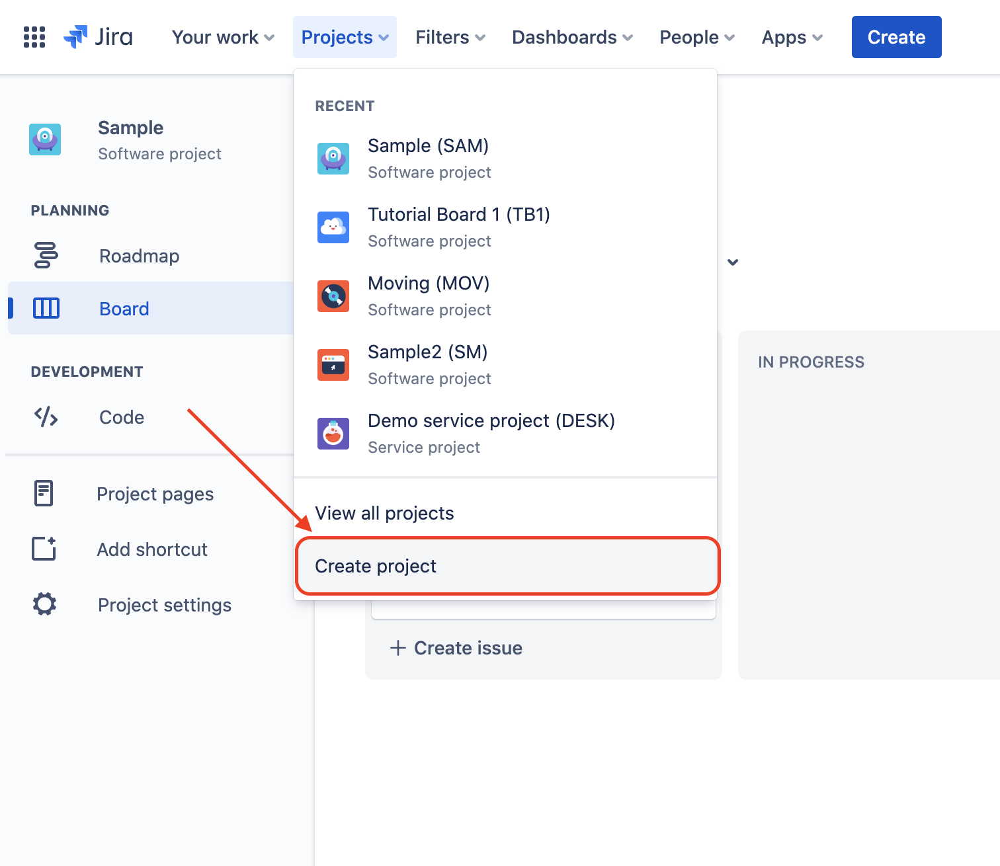

# How to create, populate, start, and complete a sprint in Jira

The main purpose for this guide is to show someone new to the Jira tool and sprints, how to create, populate, start, and complete a sprint in Jira. To that end, the guide is divided into two main parts: one informational part first, providing the context for why we would want to use Jira or sprints for project management, and second, a step-by-step walkthrough to demonstrate exactly what you have to do to create, populate, start, and then finally complete a sprint using the Jira tool.

## Prerequisites

* Access to a Jira account in which you have sufficient permissions to create projects and sprints

* Some familiarity with the [basics of project management](https://projectmanagment101.com)

## How JIRA helps organize and track the execution of tasks

Jira is a tool that is used to organize and track the execution of many discrete tasks, *which in Jira are called 'issues'*. This can be helpful for accomplishing larger goals and projects, as most projects can be broken down further into many issues. If all of the necessary issues for a project are complete, we know the project as a whole is complete. Therefore, breaking a project down issue-by-issue makes the job of managing that project more tractable because we can more easily check how much work has already been done on the project, as well as how much is still left. This, in turn, can make both planning the project as well as tracking and reporting on the status of the project much easier. 

### Jira for task organization

In Jira, tasks are first organized by the Jira project to which they belong. A project in Jira is the highest level of issue organization. Each project has a roadmap to further organize issues at a high level. The roadmap is the top-down view of all the issues essential to the project. For example, suppose our project was 'Moving' - to track the project of moving homes from one place to another. Then, we would have a roadmap where we could further organize our move into large key junks of work called 'epics'. In the case of our 'Moving' project, we could break it down further: an epic for packing up my office named 'Pack Office', another one for packing the bedroom named 'Pack Bedroom', and so on. All the epics together would then constitute the roadmap and could each in turn be broken down further into different issues, such as 'Prepare Boxes', 'Pack Desk' and 'Pack Closet'. 

### Sprints in Jira for tracking task execution

In addition to a roadmap, each Jira project also has a backlog, which organizes tasks differently than the project's roadmap. The roadmap is top-down oriented and hierarchically organized in terms of epics at top, then the issues of those epics listed under them. The backlog focuses more on the issues that make up the epics, as well as issues that don't have an epic. This is because we use the backlog to package up sets of issues for the purposes of how we actually want to execute those issues, and this could look much different than how issues are organized on the roadmap. For instance, returning to our example of moving our house, we may not want to complete all the issues associated with the epic 'Pack Office' before moving onto the issues of the epic 'Pack Bedroom'. 

Packaging up tasks from the backlog into just those tasks we want to in one time-period is what sprints in Jira are for. Sprints are time-bounded periods wherein you want to accomplish a set of discrete issues. Suppose we wanted to do the 'Prepare Boxes' issue for packing our bedroom and the 'Prepare Boxes' issue for packing our office on the same day before moving onto any of the other tasks for packing our bedroom or office. To accomplish this, we could implement a one-day sprint in Jira with just the two items included: 'Prepare Boxes' for the bedroom and 'Prepare Boxes' for the office. This gives us the flexibility to package up issues differently each time we want to take on some work. Maybe next we want to do a three-day sprint and finish up all the rest of the issues associated with packing up just the office.

## Walking through creating, populating, starting, and completing a sprint in Jira

Now that we have talked about some of how Jira helps with the issue organization and issue tracking to set some context, in what follows we will walk through the steps entailed for actually creating a sprint from scratch, populating that sprint with issues, starting the sprint, and then finally completing the sprint.

### How to create a sprint in Jira

First, to create a new sprint in Jira, let's start with a new project. 

#### How to create a new Jira project

1.  To create the Jira project in which you want to create a new sprint, first select the `Create project` option from the `Projects` dropdown in the navigation bar at the top of the screen. 

 

2. Next, you will be presented with the `Project templates` page, where you can configure the project to your specifications. For this walkthrough, select the `Software Development` option in the top-left corner and then the `Scrum` option in between `Kanban` and `Bug Tracking`. The `Scrum` option is what will allow us to create a Sprint once we have our new project.

 

This will then show you a scrum information view, which explains the main features of choosing the Scrum project template, such as organizing issues into sprints. To continue, click the `Use Template` button in the top-right corner.

 

3. For this step, you will choose a project type. for the purposes of this walkthrough, we will select the team-managed project option instead of company-managed.

 

4. To finish creating your new project, give the project a name (here we will name our project 'Tutorial Board 2') and then click the `Create project` button in the lower-right part of the page.

 

This will land you on your new project's `Board` view, which should be empty due to our project being brand new.

 

#### How to create a sprint from the backlog

Now that we have a project, we can create a sprint from the backlog.

1. First, on the left vertical menu, select the `Backlog` tab, which will take you to the backlog for your newly created project. 

 

Now that you are viewing the Backlog for your selected project, you should notice that you already have a sprint available to be populated by default. However, let's ignore this sprint for now, since here we are focused on the task of creating a new sprint. 

2. To create a new sprint, click the `Create Sprint` button on the right-side of the screen across from the `Backlog` dropdown.

 

You should then see a new sprint created on the `Backlog` page above the `Backlog` dropdown section.

 

### How to populate a sprint in Jira

Now that we have our sprint created, we can begin populating the sprint with issues. Of course, we don't have any issues yet for which to populate the sprint, so we need to make some. 

#### Creating new issues from the backlog

To create a new issues to add to your sprint, you have three options from the backlog view: 
- you can create a new issue from the Backlog by clicking `+ Create Issue` button under the `Backlog` dropdown. 
- you can create one directly into the sprint by clicking the other `+ Create Issue` button at the bottom of the sprint in question.
- you can first create an epic issue type by clicking the `+ Create Epic` button in the epic panel.

 

Let's first create an epic to organize some issues.

1. Click the `+ Create Epic` button at the bottom of the Epic panel and enter a name for the epic (here we call our epic 'New Epic 1').

 

Now we have an empty epic. Let's create an issue for the epic from the backlog.

2. With your new epic still selected in the Epic panel, click the `+ Create Issue` button under the `Backlog` dropdown. We can see that the new issue will default to a story type of issue. 

You can change this to a Task issue type or a Bug issue type by using the dropdown to the left of the name of the issue.

 

**Note that because we had our epic selected when you clicked `+ Create Issue`, the new issue you make will belong to that epic, New Epic 1.**

3. Once you have chosen the issue type (here we stay with the story issue-type) from the issue-type dropdown, you should add a summary of the issue in the field to the right which says `What needs to be done?`. Here we will add a story named 'Add me to sprint!'.

 

4. If you want to add more information into the ticket, such as a Description, Assignee, Label, or a status, first select the issue you want to add information to, then click the field you want to add to in the issue panel that appears to the right of the screen and, finally, add your change.

 

 It should be noted that you can delete issues from the Backlog by clicking on the `...` menu for that issue and selecting the `Delete` option. **However, if you delete an issue, you will no longer be able to track it. Unless you make a mistake when creating an issue that you do not need to track, it is better to move its status to DONE, rather than delete that issue.**

5. Finally, to add the new issue to the sprint you just created, drag and drop the issue onto the sprint and it will show up there.

 

Now your sprint contains at least one issue and can be started. Now usually you would not start a sprint with just one issue, but for the purposes of this walkthrough, it is sufficient.

### How to start and complete a sprint in JIRA

1. To start the Sprint you have just populated, first click the `Start Sprint` button of the sprint.

 

2. This will bring up the `Start Sprint` modal. Here you will need to confirm or change the default name of the sprint (in our case TB2 Sprint 2), confirm or change the default duration of the sprint (defaults to 2 weeks), as well as confirm or change the start date (defaults to the current date). The end date will be set by default, as it is a function of the duration you choose from the `Duration` dropdown and the start date chosen in the `Start date` field below. Moreover, *while not necessary to start a sprint, it is often helpful to add a sprint goal to summarize the work taken on for the sprint, so you can more easily judge the success of the sprint*. In our case here, we can set it to 'Learn how to start and complete a sprint in Jira'. Lastly, select the `Start` button to start the new sprint.

 
 
Once complete, you will be presented with the new sprint on the `Board` tab of the left navigation menu. Here you can move issues through their lifecycle by dragging and dropping the issue to the chosen column. Here we have a `TO DO` column, an `IN PROGRESS` column, and a `DONE` column. You can also see your issue 'Add me to sprint' in the `TO DO` column.

 

3. Let's go ahead and move our 'Add me to sprint!' issue to the `DONE` column, since we have already successfully added the issue to the sprint. Now all current issues in the sprint are complete. Usually issues do not go straight from the `TO DO` column to the `DONE` and instead go to the `IN PROGRESS` column while being worked on. In this case we needed only to add the issue to the sprint, so we are done with that issue. 

 

4. Now that your sprint is complete because you completed all the issues, you can click the `Complete Sprint` button in the top-right of the `Board` page to bring up the Complete sprint modal. 

 

The Complete sprint modal that pops up is the last step in completing a sprint. It tells us how many issues were in the sprint and how many of them we completed. In this walkthrough, we completed all of the issues. If there were any issues still not complete, the Complete sprint modal would have an option to move the open issues to a new sprint or back to the backlog. 

5. To complete this sprint, just select the `Complete sprint` button.

 

You will be returned to the `Backlog` tab. Your sprint is now complete.

After some initial context regarding how Jira organizes and tracks issues, we then walked through how to create a sprint from scratch by creating a new project first. Then we walked through how to create a sprint in the new project, populate that sprint with new issues from the backlog, start the newly populated sprint, and finally we walked through how to complete the sprint. You now should have the knowledge to organize and track the execution of your project's issues by creating your own sprints as you find them needed.

